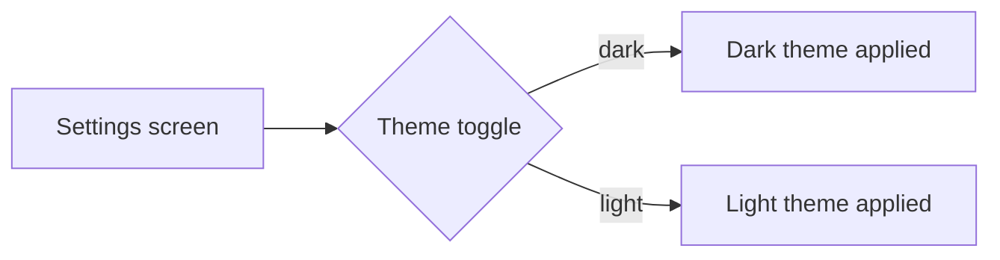

# Wireframe Template

Markdown-native wireframe for `appmaker/features/<NNN>/wireframe.md`. Produced by the `prd`
skill (step 3.5) BEFORE acceptance criteria exist, so humans catch intent drift early.

**Direction (do not invert):** the wireframe is a **view of** the PRD — it never originates
product intent. After PRD criticisms are written, annotate each region with the `pcrit-*` it
illustrates in the `## Traces` section. (METHOD open-invariant #1.)

**Format:** mermaid + ASCII only. No HTML, no MDX, no binary. Renders on GitHub, diffs cleanly,
stays consistent across models. Optional real screenshot via gstack `$B` when a live UI exists.

## Template

```markdown
---
feature: add-dark-mode
folder: 003-add-dark-mode
created: 2026-05-11
last_updated_by: prd
surface: ui                        # ui | api | both
---

# Wireframe: Add Dark Mode

## Flow / structure (mermaid)



## Layout sketch (ASCII)

```
+------------------------------------------+
|  Settings                         [x]    |
+------------------------------------------+
|  Appearance                              |
|    ( ) Light   (•) Dark   ( ) System     |
|                                          |
|  [ Save ]                                |
+------------------------------------------+
```

## API shape (when surface is api / both)

```
GET  /api/preferences        -> { theme: "light"|"dark"|"system" }
PUT  /api/preferences        body { theme } -> 200 { theme }
```

## Open questions (resolve before AC)

- Does "System" follow OS at runtime or only on load?
- Persist per-device or per-account?

## Traces

Filled after PRD criticisms exist. Each region links to the `pcrit-*` it illustrates —
the wireframe shows intent the PRD asserts, never new intent.

| Region | Illustrates |
|---|---|
| Theme toggle (3 states) | pcrit-001 |
| Persisted preference | pcrit-003 |
| PUT /api/preferences shape | pcrit-004 |
```

## Notes

- Produce this artifact ONLY when the feature has a user-facing UI surface OR an external API
  surface. For pure internal/refactor work, skip it and note "no UI/API surface" in the PRD.
- Keep it small — one flow diagram, one layout sketch, the API shape if relevant. It is a
  drift-catch tool, not a design spec.
